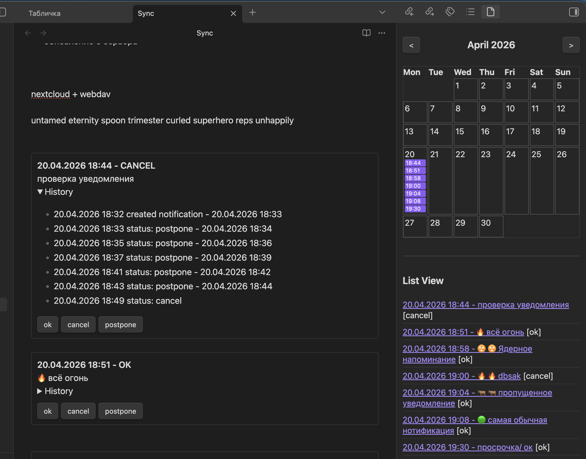
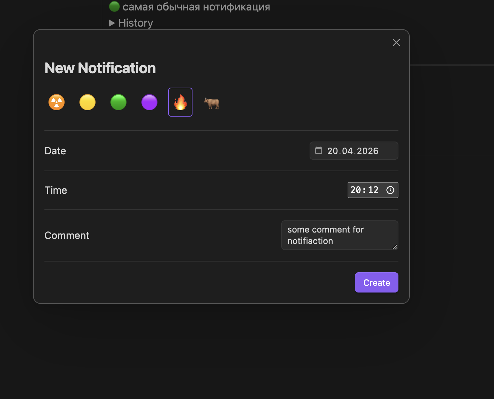
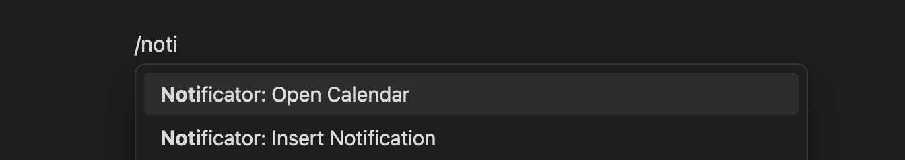
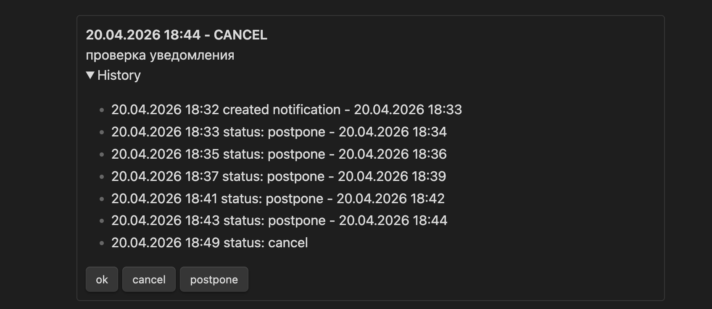
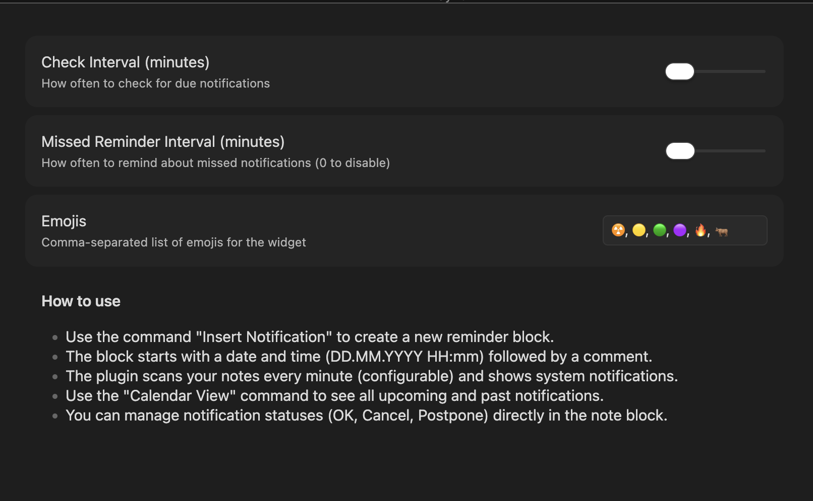

# Obsidian Notificator

Плагин для управления уведомлениями и задачами с привязкой ко времени прямо в ваших заметках Obsidian. Отслеживайте важные события, просматривайте их на календаре и получайте системные уведомления.



## Основные возможности

- **Умные уведомления**: Создавайте уведомления с комментариями, которые сработают точно в срок.
- **Интерактивный Календарь**: Наглядное представление всех запланированных событий в боковой панели.
- **История изменений**: Каждое уведомление хранит историю действий (создание, завершение, перенос).
- **Системные алерты**: Интеграция с системными уведомлениями вашей ОС.
- **Напоминания о пропущенных**: Если вы пропустили уведомление, плагин будет напоминать о нем с заданным интервалом.
- **Гибкие статусы**: Управляйте состоянием уведомлений прямо из заметки: `OK`, `Cancel`, `Postpone`.
- **Повторяющиеся уведомления**: Возможность задать расписание повторов (еженедельно, ежемесячно и т.д.) с помощью символа `🔄`.

## Использование

### Создание уведомления

Вы можете создать уведомление вручную, используя кодовый блок `notifiactor`, или через команду "Insert Notification".



Пример кодового блока:
```notifiactor
20.04.2026 20:30 Важный звонок
-- history
20.04.2026 20:25 created notification - 20.04.2026 20:30
```

### Повторяющиеся уведомления

Вы можете создавать уведомления, которые будут автоматически переноситься на следующую дату после нажатия кнопки **OK**. Для этого в первой строке после комментария добавьте символ `🔄` и расписание.

Примеры расписаний:
- `every Monday` или `every пн` — каждый понедельник
- `every 2 weeks` — каждые 2 недели
- `every month on 15` — 15-го числа каждого месяца
- `every day` — каждый день

Пример кодового блока с повтором:
```notifiactor
20.04.2026 10:00 Еженедельный созвон 🔄 every Monday
-- history
19.04.2026 18:00 created notification - 20.04.2026 10:00
```

### Команды

Плагин добавляет несколько удобных команд в палитру (Ctrl/Cmd + P):
- `Insert Notification`: Вызывает модальное окно для создания нового уведомления.
- `Open Calendar`: Открывает панель календаря.



### Интерфейс уведомления в заметке

Каждое уведомление отображается в виде интерактивного блока с кнопками управления.



- **OK**: Помечает задачу как выполненную.
- **Cancel**: Отменяет уведомление.
- **Postpone**: Позволяет перенести событие на другое время.

## Настройки

В настройках плагина вы можете изменить:
- **Check Interval**: Как часто плагин сканирует заметки на наличие активных уведомлений.
- **Missed Reminder Interval**: Интервал повторных напоминаний для пропущенных событий.
- **Emojis**: Набор эмодзи для быстрой пометки уведомлений.



## Установка

1. Найдите `Notificator` в Community Plugins в настройках Obsidian.
2. Нажмите **Install**, а затем **Enable**.
3. (Альтернативно) Скопируйте файлы `main.js`, `manifest.json` и `styles.css` в папку `.obsidain/plugins/obsidian-notificator/`.

---
Разработано для эффективного планирования внутри Obsidian.
